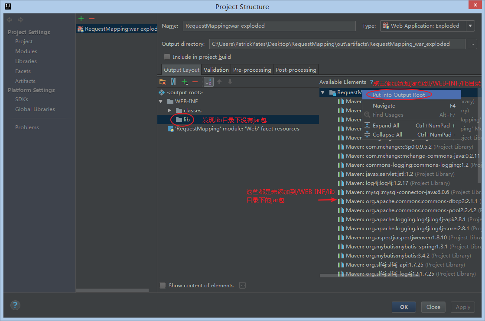
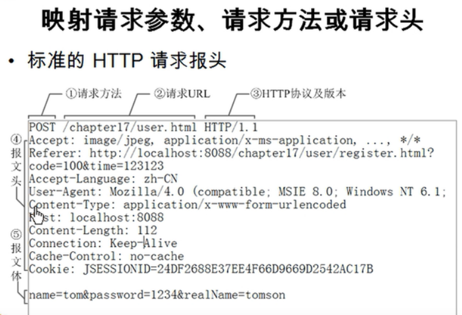
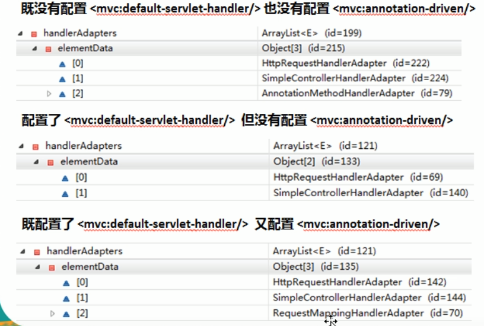
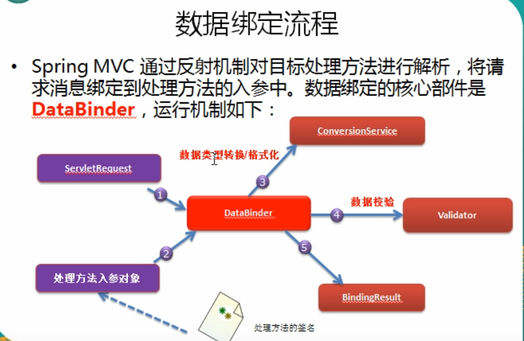
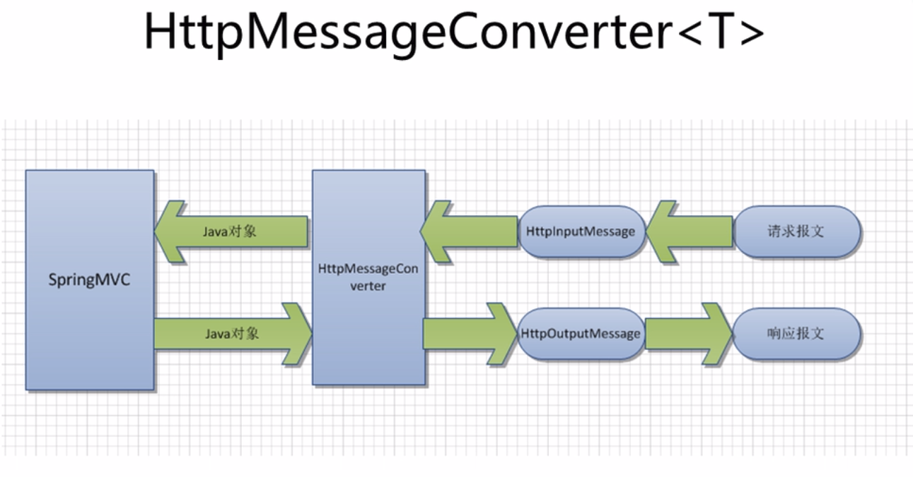
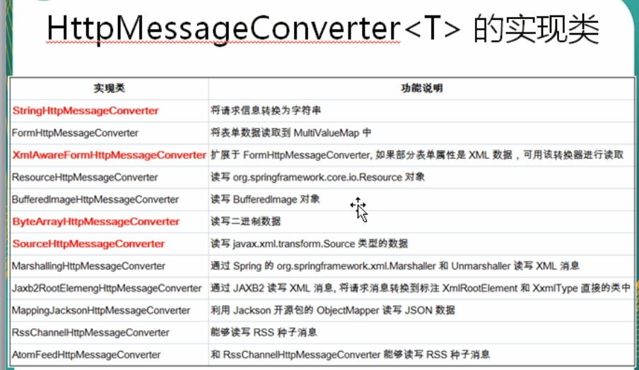
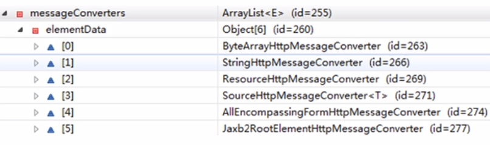

 Spring MVC 学习
> 在idea中新建的时候，初次运行，如果遇到 java.lang.ClassNotFoundException:org.springframework.web.context.ContextLoaderListener 错误
解决办法： 将 Project Structure 打开，选择Artifacts ， 在Output Layout –> Web-INF查看是否有lib目录， 如果没有，就在 右边Available Elements 窗口，
右键 Put into Output Root， 这样就OK了。


# HelloWorld
1. 在idea中新建 spring mvc 项目
2. 配置xml文件， 默认的配置文件在  /WEB-INF/<servlet-name>-servlet.xml， 这里的<servlet-name>是在 web.xml中
<servlet-name>标签的值， 如果自己配置的话，可以这样写,如下就把配置放在了  src/springmvc.xml 中
    ```xml
        <servlet>
            <servlet-name>dispatcher</servlet-name>
            <servlet-class>org.springframework.web.servlet.DispatcherServlet</servlet-class>
            <init-param>
                <param-name>contextConfigLocation</param-name>
                <param-value>classpath:springmvc.xml</param-value>
            </init-param>
            <load-on-startup>1</load-on-startup>
        </servlet>
    ```
3. 然后在servlet的xml配置文件中，添加扫描和前后缀配置
    ```xml
        <!--配置自定义扫描包-->
        <context:component-scan base-package="com.hcyshmily"></context:component-scan>
    
        <!--配置视图解析器 如何把handler返回值解析为实际的物理视图 -->
        <bean class="org.springframework.web.servlet.view.InternalResourceViewResolver">
            <property name="prefix" value="/WEB-INF/views/"></property>
            <property name="suffix" value=".jsp"></property>
        </bean>
    ```
4. 然后，添加控制器类
    ```java
    package com.hcyshmily.handlers;
    import org.springframework.stereotype.Controller;
    import org.springframework.web.bind.annotation.RequestMapping;
    @Controller
    public class HelloWorld {
        /**
         * 1. 使用@RequestMapping来映射请求的URL
         * 2. 返回值会通过试图解析器，解析成物理视图
         *  prefix + returnValue + suffix 得到实际的物理视图位置
         * @return 返回的视图
         */
        @RequestMapping("/helloworld")
        public String hello() {
            System.out.println("Hello World!");
            return "success";
        }
    }
    ```
5. 添加视图， 在 /WEB-INF/views目录中，
    ```
    <%@ page contentType="text/html;charset=UTF-8" language="java" %>
    <html>
    <head>
        <title>Success</title>
    </head>
    <body>
        <h4>Success</h4>
    </body>
    </html>
    ```
6. 启动（需要一些简单配置，在右上方配置到tomca即可)

# @RequestMapping 注解
 * 这个注解为控制器指定可以处理哪些URL请求
 * 在类和方法中都可以标注，但是，却有所不同
    1. 类定义处： 提供初步的映射信息，相对于根目录，也就是方法处注解路径的前置路径部分
    2. 方法处： 提供进一步的细分映射信息，相对于定义出的URL，若方法定义处没有标注注解，则默认使用类定义处的

 * 一个基本的http请求会有这些东西


* @RequestMapping的value、method、params以及header分别表示请求URL，请求方法，参数，以及
请求头的映射条件，它们之间的关系，联合使用可以让请求更加精确化.
> 如下代码，指定方法 POST， url地址 /testMethod  返回视图 success
```
    @RequestMapping(value = "/testMethod", method = RequestMethod.POST)
    public String testMethod() {
        System.out.println("testMethod");
        return “success”;
    }
```
> params 和 headers 支持简单的表达式
----
    1. param1   :表示请求必须包含名为param1的请求参数
    2. !param1  ：表示，请求不能包含名为param1的请求参数
    3. paramm1!=value  : 表示请求包含名为param1的请求参数，但其值不能为 value1
    4. {"param1=value1", param2} : 表示请求必须包含名为param1和param2的两个请求参数，且 param1的参数的值必须为value1
----
* Ant 风格资源地址支持3种匹配符
    1. ? :匹配一个字符   /user/create?   => user/createA,  user/createB
    2. \* : 匹配一个段的字符   /user/*/create  => /user/jack/create  , /user/yang/create
    3. \*\*: 匹配任意个段,  /user/**/create  => /user/create   , /user/aa/create , /user/aa/bb/cc/create

* @PathVariable  可以来映射URL中的占位符到目标方法的的参数中
```
    /**
     * @PathVariable  可以来映射URL中的占位符到目标方法的的参数中
     * @param id
     * @return
     */
    @RequestMapping("/testPathVariable/{id}")
    public String testPathVariable(@PathVariable("id") Integer id) {
        System.out.println("testPathVariable:" + id);
        return SUCCESS;
    }
```

* HiddenHttpMethodFilter 可以将POST请求转成 delete 和 put 请求（tomcat8不支持！）

* @RequestParam 请求参数获取
    1. value 参数名
    2. required 是否必须，默认是
    3. defaultValue 默认值
```
    @RequestMapping(value = "/testRequestParam")
    public String testRequestParam(@RequestParam(value = "username") String un, @RequestParam(value = "age", required = false, defaultValue = "0") int age) {
        System.out.println("testRequestParam: username:" + un + ",age:" + age);
        return SUCCESS;
    }
```
* @RequestHeader 请求头参数， 和 RequestHeader 一样，可以指定参数名，是否必须，设置默认值

* @CookieValue 获取cookie值， （开发中很少用)
```
    @RequestMapping("/testCookieValue")
    public String testCookieValue(@CookieValue("JSESSIONID") String j) {
        System.out.println("testCookieValue, JSESSIONID: " + j);
        return SUCCESS;
    }
```

* 使用 POJO 对对象进行 CURD操作
```
    @RequestMapping(value = "/testPojo", method = RequestMethod.POST)
    public String testPojo(User user) {
        System.out.println("testPojo, user: " + user);
        return SUCCESS;
    }
```
```html
  <form action="/springmvc/testPojo" method="post">
    <br>
    username:<input type="text" name="name" />
    <br>
    password:<input type="password" name="password" />
    <br>
    email:<input type="text" name="email" />
    <br>
    province:<input type="text" name="address.province" />
    <br>
    city:<input type="text" name="address.city" />
    <br>
    <input type="submit" value="Submit" />
  </form>
```

* 可以使用Servlet原生的 API
```
    /**
     * 可以使用 Servlet 原生的 API 作为目标方法的参数， 具体支持以下类型
     * HttpServletRequest
     * HttpServletResponse
     * HttpSession
     * Java.security.Principal
     * Locale InputStream
     * OutputStream
     * Reader
     * Writer
     * 
     * @param request
     * @param response
     * @return
     */
    @RequestMapping("/testServletAPI")
    public String testServletAPI(HttpServletRequest request, HttpServletResponse response) {
        System.out.println("testServletAPI, request: " + request + ", " + response);
        return SUCCESS;
    }

    /**
     * Spring mvc 会按照请求参数名和POJO属性名进行自动匹配
     * 自动为该对象填充属性值，支持级联属性， 如  user.address.province
     *
     * 传入pojo属性，就会自动生成对象, 这个在开发的时候用的会很多
     * @return
     */
    @RequestMapping(value = "/testPojo", method = RequestMethod.POST)
    public String testPojo(User user) {
        System.out.println("testPojo, user: " + user);
        return SUCCESS;
    }
```

## 处理模型数据
1. ModelAndView ： 处理方法返回类型为 ModelAndView， 方法体可以通过该对象添加模型数据
```
    @RequestMapping("/testModelAndView")
    public ModelAndView testModelAndView() {
        // 小插曲， 引包不要引错了。是这个  import org.springframework.web.servlet.ModelAndView;
        String viewname = "ModelAndView";
        ModelAndView modelAndView = new ModelAndView(viewname);
        modelAndView.addObject("time", new Date());
        return modelAndView;
    }
```
```
view中这么调用
<h4>Time: ${requestScope.time}</h4>
```

2. Map 及 Model： 入参为 org.springframework.ui.Model、org.springframework.ui.ModelMap
或java.util.Map时， 处理方法返回时，Map中的数据会自动添加到模型中去(本质上也是扔到 ModelAndView中)
> Spring MVC在内部使用了org.springframework.ui.Model接口存储模型数据, 在调用方法前会创建一个隐含的模型对象作为模型数据的存储容器。
如果方法的入参为Map或Model类型，则会将疑难的引用传递给这些入参
```
    @RequestMapping("testMap")
    public String testMap(Map<String, Object> map) {
        System.out.println(map.getClass().getName());
        map.put("names", Arrays.asList("AAA", "bbb", "CCC"));
        return "Map";
    }
```
```
view中这么调用
<h2>names: ${requestScope.names}</h2>
```

3. 若希望在多个请求之间共用某个模型数据类型，则可以在控制器类上标注一个 @SessionAttributes， Spring 将在
模型中对应的属性暂存到 HttpSession中.
> @SessionAttributes处理可以通过【属性名】指定需要放到会话中的属性外，还可以通过模型属性的【对象类型】
指定哪些模型属性需要放到会话中.比如
```
// 将会把带有所有是 user属性名的，age属性名的存起来， 然后，把所有 value值类型是 String的东西存起来
// 这个注解要放在类中！！！
@SessionAttributes(value={"user", "age"}, types={String.class});

    @RequestMapping("/testSessionAttributes")
    public String testSessionAttributes(Map<String, Object> map) {
        User user = new User("Jack", "pass", "Jack@233.com");
        map.put("user", user);
        map.put("age", 25);
        return "SessionAttributes";
    }
```
```
<h2>age: ${sessionScope.age}</h2>
```

# CURD

* 处理静态文件时，需要配置,在 sprimgmvc.xml中
    ```xml
    <mvc:default-servlet-handler/>
    <mvc:annotation-driven></mvc:annotation-driven>
    ```
    > default-servlet-handler 是spring默认的handler，如果是静态资源请求，就给它处理，如果不是
    静态资源请求，才给DispatcherServlet处理
    
   
* POJO 提交处理时，需要把form 加上 enctype="application/x-www-form-urlencoded" 属性 ！！！

* @Autowired 注解的不能是静态的！

#  how  annotation-driver   work.
* \<mvc:annotation-driven /> 会自动注册，
<b>RequestMappingHandelerMapping、RequestMappingHandelAdapter、
ExceptionHandlerExceptionResolver 三个bean.</b>

* 还将提供以下支持:
1. 支持使用 ConversionService实例对表单参数进行类型转换
2. 支持使用@NumberFormatannotation、@DataTimeFormat 注解完成数据类型的格式化
3. 使用 @Valid 注解对 JavaBean实例进行 JSR 303 验证
4. 支持使用 @RequestBody 和 @ResponseBody 注解 

* 如图


# @InitBinder
* 由 @InitBinder标识的方法，可以对WebDataBinder对象进行初始化。WebDataBinder是DataBinder的子类.
用于完成由表单字段到JavaBean属性的绑定.
* @InitBinder方法不能有返回值，必须声明为 void
* @InitBinder 方法的参数通常是WebDataBinder

```
    // 这里是在赋值时，不给 lastName属性进行赋值
    @InitBinder
    public void initBinder(WebDataBinder binder) {
        binder.setDisallowedFields("lastName");
    }
```



# 数据格式化(数据格式的转换)

* Spring 在格式化模块中定义了一个实现 ConversionService的接口 <b>FormattingConversionService</b>实现类 <br>
因此它既具有类型转换的功能，又具有格式化的功能.

* FormattingConversionService 拥有一个 FormattingConversionServiceFactoryBean 工厂类，
后者用于在Spring上下文构造前.

* FormattingConversionServiceFactoryBean 内部已经注册了： 
    > NumberFormatAnnotationFormatterFactory ：支持对数字类型的属性，使用 @NumberFormat注解<br>
    JodaDateTimeFormatAnnotationFormatterFactory: 支持对日期类型属性使用 @DateTimeFormat注解
    
* 装配了 FormattingConversionServiceFactoryBean 后，就可以在 Spring MVC 入参绑定及模型数据输出时<br>
使用注解驱动了。
    > \<mvc:annotation-driven /> 默认创建的 ConversionService实例即为 FormattingConversionServiceFactoryBean

> @DateTimeFormat 注解可对 java.util.Date、java.util.Calendar、 java.long.Long时间类型进行标注<br>
@NumberFormat 可对类似数字类型的属性进行标注。

# 数据校验
1. 使用注解
```
     // 提供类型转换的格式， 这里是字符串转date类型
      @DateTimeFormat(pattern = "yyyy-MM-dd")
      private Date birth;
```
> JSR 303是Java为Bean数据合法性校验提供的标准框架,已经包含在JavaEE6.0中.
JSR303通过在Bean属性上标注,类似于 @NotNull、@Max 等标注注解进行校验.

* Spring4.0拥有自己独立的数据校验框架，同时支持JSR303标准校验框架。
* Spring 在进行数据绑定时，可同时调用校验框架完成数据校验工作。在Spring MVC中，可以直接通过
注解驱动的方式进行数据校验。
* Spring 的 LocalValidatorFactoryBean即实现了Spring的Validator接口，也实现了
JSR303的Validator接口。只要在Spring容器中定义一个 LocalValidatorFactoryBean即可将其
注入到需要校验的Bean中。
* \<mvc:annotation-driver/> 会默认装配好一个LocalValidatorFactoryBean。通过在处理方法的入参上标注@valid注解
即可让Spring MVC在完成数据绑定后执行数据校验工作.
* Spirng 本身么有提供JSR303的实现，所以需要手动把包加进去

# 返回JSON
* 引入正确的 jackson包，在返回的时候，不用处理 Collection， Map这些，就会自动处理成json返回
>  1. 加入jar包 \[jackson-annotations.jar, jackson-core.jar, jackson-databind.jar\]
>  2. 编写目标方法
>  3. 在方法上添加 @ResponseBody注解.

> 如果jackson的版本和Spring 的版本对不上，就会出问题 (= =, 试了很多个版本，都不行...)

* 之所以能返回JSON这得得益于 HttpMessageConverter<T>
> HttpMessageConverter<T>是Spring3.0新添加的一个接口，负责将请求信息转换为一个对象（类型为T）
将对象(类型T)输出为响应信息.<br>
HttpMessageConverter<T> 工作流程图

* HttpMessageConverter\<T>本身有很多的实现类

* 这些是Spring默认搭载的实现类



